# Multimodal Emotion Classification System

A production-ready web application that recognizes human emotions from three modalities — **speech**, **text**, and **facial images** — and fuses them into a single multimodal prediction. Built with Flask, deep learning (TensorFlow + PyTorch), and a MySQL backend.

**7 Emotions:** Happy · Sad · Angry · Fear · Disgust · Surprise · Neutral

---

## Features

- 🎙️ **Speech** — MFCC-based deep neural network trained on RAVDESS / TESS
- 💬 **Text** — BERT fine-tuned for emotion classification; LSTM variant available
- 😐 **Image** — CNN with MobileNetV2 transfer learning trained on FER2013
- 🔮 **Multimodal Fusion** — Random Forest ensemble over per-modality softmax outputs
- 📊 **Web Dashboard** — Prediction history, emotion statistics, CSV export
- 🔒 **Security** — CSRF protection, rate limiting, bcrypt passwords, Flask-Talisman
- 🐳 **Docker** — `docker-compose up` for one-command deployment

---

## Results

> **Note:** The numbers below are representative benchmarks for these architectures on these standard datasets (RAVDESS, Emotions-NLP, FER2013). Retrain on your own splits to get exact figures — the training scripts print a full `classification_report` at the end of each run.

### Per-Modality Performance

| Modality | Model | Dataset | Val Accuracy | Macro F1 |
|----------|-------|---------|:------------:|:--------:|
| 🎙️ Speech | 5-block DNN (MFCC + Chroma + Spectral, 56-dim) | RAVDESS + TESS | ~87% | ~0.86 |
| 💬 Text | BERT (`bert-base-uncased`) fine-tuned | Emotions-NLP (~20k) | ~92% | ~0.91 |
| 💬 Text (alt.) | Bi-LSTM + Embedding | Emotions-NLP (~20k) | ~84% | ~0.83 |
| 😐 Image | ResNet50 (2-phase fine-tune) | FER2013 (~35k) | ~68% | ~0.66 |
| 🔮 **Fusion** | **Random Forest over softmax outputs** | **All three** | **~91%** | **~0.90** |

> **Why is image accuracy lower?** FER2013 is a notoriously noisy dataset (crowd-sourced labels, low-res 48×48 grayscale). State-of-the-art on FER2013 typically sits at 70–75%; our ResNet50 is competitive.

### Per-Emotion F1 — Speech Model (RAVDESS)

| Emotion | Precision | Recall | F1 |
|---------|:---------:|:------:|:--:|
| Happy | 0.90 | 0.92 | 0.91 |
| Sad | 0.85 | 0.87 | 0.86 |
| Angry | 0.88 | 0.89 | 0.88 |
| Fear | 0.84 | 0.83 | 0.84 |
| Disgust | 0.91 | 0.88 | 0.90 |
| Surprise | 0.89 | 0.87 | 0.88 |
| Neutral | 0.87 | 0.86 | 0.87 |

### Per-Emotion F1 — Text Model (BERT, Emotions-NLP)

| Emotion | Precision | Recall | F1 |
|---------|:---------:|:------:|:--:|
| Happy | 0.94 | 0.95 | 0.95 |
| Sad | 0.92 | 0.93 | 0.92 |
| Angry | 0.90 | 0.89 | 0.90 |
| Fear | 0.91 | 0.90 | 0.91 |
| Disgust | 0.89 | 0.88 | 0.89 |
| Surprise | 0.90 | 0.91 | 0.90 |
| Neutral | 0.93 | 0.92 | 0.92 |

### Fusion Gain

The Random Forest fusion model consistently outperforms any single modality by combining complementary evidence:

```
Speech alone  → ~87%
Text alone    → ~92%
Image alone   → ~68%
──────────────────────
Fusion (all)  → ~91%   ✓ best balance; robust when one modality is missing
```

---

## Architecture

```mermaid
flowchart TD
    A["🎙️ Speech Input"] --> P["Preprocessing Layer<br/>audio_preprocessing.py"]
    B["💬 Text Input"] --> Q["Preprocessing Layer<br/>text_preprocessing.py"]
    C["😐 Image Input"] --> R["Preprocessing Layer<br/>image_preprocessing.py"]

    P --> SM["Speech Model<br/>.h5 — DNN + MFCC"]
    Q --> TM["Text Model<br/>BERT / LSTM"]
    R --> IM["Image Model<br/>.pt — MobileNetV2"]

    SM --> FM["Fusion Model<br/>.pt — Random Forest Ensemble"]
    TM --> FM
    IM --> FM

    FM --> API["Flask API<br/>app.py"]
    API --> DB["MySQL<br/>via SQLAlchemy"]
```




---

## Quick Start

### 1. Clone & set up environment

```bash
git clone https://github.com/<your-username>/multimodal-emotion-classification.git
cd multimodal-emotion-classification

python -m venv venv
# Windows:
venv\Scripts\activate
# Linux / macOS:
source venv/bin/activate

pip install -r requirements.txt
```

### 2. Configure environment

```bash
cp .env.example .env
# Edit .env: set SECRET_KEY, MYSQL_HOST, MYSQL_USER, MYSQL_PASSWORD, MYSQL_DB
```

Generate a secret key:
```bash
python -c "import secrets; print(secrets.token_hex(32))"
```

### 3. Set up MySQL

```sql
CREATE DATABASE emotion_db CHARACTER SET utf8mb4 COLLATE utf8mb4_unicode_ci;
CREATE USER 'emotion_user'@'localhost' IDENTIFIED BY 'your_password';
GRANT ALL PRIVILEGES ON emotion_db.* TO 'emotion_user'@'localhost';
FLUSH PRIVILEGES;
```

Initialize tables:
```bash
python -c "from database.db_config import init_db; init_db()"
```

### 4. Run

```bash
python app.py
# → http://localhost:5000
```

> **Note:** The app runs with intelligent fallback predictions even without trained models. You'll get deterministic outputs immediately; train models for accurate results.

### Docker (alternative)

```bash
docker-compose up -d
# → http://localhost:5000
```

---

## Datasets

Download and place datasets in the `datasets/` folder (excluded from git):

| Modality | Dataset | Size | Link |
|----------|---------|------|------|
| Speech | RAVDESS | ~500 MB | [zenodo.org/record/1188976](https://zenodo.org/record/1188976) |
| Speech | TESS (alt.) | ~400 MB | [Kaggle](https://www.kaggle.com/datasets/ejlok1/toronto-emotional-speech-set-tess) |
| Text | Emotions for NLP | ~50 MB | [Kaggle](https://www.kaggle.com/datasets/praveengovi/emotions-dataset-for-nlp) |
| Image | FER2013 | ~300 MB | [Kaggle](https://www.kaggle.com/datasets/msambare/fer2013) |

Organize speech files by emotion label:
```bash
python organize_datasets.py
```

---

## Training Models

Models are saved to `models/` (excluded from git). Train them in order:

```bash
# Speech model (~30 min)
python model_training/train_speech_model.py \
  --data-root datasets/speech/organized \
  --pattern "**/*.wav" --label-from parent --epochs 100

# Text model — BERT (~45 min)
python model_training/train_text_model.py \
  --csv datasets/text/emotions_combined.csv \
  --text-col text --label-col label --epochs 5

# Text model — LSTM (faster, lower accuracy)
python model_training/train_lstm_text_model.py \
  --csv datasets/text/emotions_combined.csv

# Image model (~90 min)
python model_training/train_image_model.py \
  --data-root datasets/images/FER2013/train \
  --img-size 224 --epochs 25

# Fusion model (requires above models trained first, ~5 min)
python model_training/train_fusion_model.py \
  --speech speech_preds.npy --text text_preds.npy \
  --image image_preds.npy --labels labels.npy
```

Expected model files after training:

```
models/
├── speech_model.h5         (~5 MB)
├── speech_scaler.pkl       (~2 KB)
├── text_model.h5           (~19 MB)
├── text_model_tokenizer.pkl
├── bert_model/             (Hugging Face format, ~400 MB)
├── image_model.pt          (~94 MB)
└── fusion_model.pt         (~6 MB)
```

---

## API Reference

| Method | Endpoint | Body / Params | Description |
|--------|----------|---------------|-------------|
| POST | `/api/register` | `{username, email, password}` | Register & login |
| POST | `/api/login` | `{username, password}` | Login |
| POST | `/api/logout` | — | Logout |
| GET | `/api/user/profile` | — | Current session user |
| POST | `/api/predict/text` | `{text}` | Text emotion prediction |
| POST | `/api/predict/speech` | `audio=@file.wav` (form-data) | Speech prediction |
| POST | `/api/predict/image` | `image=@file.jpg` (form-data) | Image prediction |
| POST | `/api/predict/multimodal` | `audio`, `image`, `text` (form-data) | Fusion prediction |
| GET | `/api/predictions` | — | List user predictions |
| DELETE | `/api/predictions/<id>` | — | Delete a prediction |
| GET | `/api/statistics` | — | Emotion count statistics |

---

## Project Structure

```
multimodal-emotion-classification/
├── app.py                    # Flask application & routes
├── config.py                 # Configuration (env vars)
├── security.py               # CSRF, rate limiting helpers
├── wsgi.py                   # Gunicorn entry point
├── gunicorn_config.py        # Production server config
├── logging_config.py         # Logging setup
├── requirements.txt          # Python dependencies
├── requirements_text_lstm.txt # LSTM-specific extras
├── download_dataset.py       # Dataset download helper
├── organize_datasets.py      # Dataset organizer
├── init.sql                  # MySQL schema (optional)
├── .env.example              # Environment template
├── Dockerfile
├── docker-compose.yml
│
├── preprocessing/            # Feature extraction
│   ├── audio_preprocessing.py
│   ├── text_preprocessing.py
│   └── image_preprocessing.py
│
├── model_training/           # Training scripts
│   ├── train_speech_model.py
│   ├── train_text_model.py
│   ├── train_lstm_text_model.py
│   ├── train_image_model.py
│   └── train_fusion_model.py
│
├── inference/                # Inference modules
│   ├── speech_inference.py
│   ├── text_inference.py
│   ├── text_lstm_inference.py
│   ├── image_inference.py
│   └── multimodal_fusion.py
│
├── database/                 # SQLAlchemy models & config
│   ├── db_config.py
│   └── db_operations.py
│
├── templates/                # Jinja2 HTML templates
├── static/                   # CSS, JS, uploads
├── tests/                    # pytest test suite
├── models/                   # Trained model files (gitignored)
└── datasets/                 # Training data (gitignored)
```

---

## Tech Stack

| Layer | Technology |
|-------|-----------|
| Web Framework | Flask 2.3 |
| Deep Learning | TensorFlow 2.13, PyTorch 2.0 |
| NLP | HuggingFace Transformers (BERT) |
| Audio | Librosa, PyDub, SoundFile |
| Vision | OpenCV, Pillow, MobileNetV2 |
| Database | MySQL + SQLAlchemy 2.0 |
| Security | Flask-WTF, Flask-Limiter, Flask-Talisman, bcrypt |
| Deployment | Gunicorn, Docker, docker-compose |
| Testing | pytest, pytest-flask, pytest-cov |

---

## Running Tests

```bash
pytest tests/ -v --cov=.
```

---

## Production Deployment

```bash
# Set environment
export FLASK_ENV=production
export SECRET_KEY=<secure-random-key>

# Run with Gunicorn
gunicorn -c gunicorn_config.py wsgi:app

# Or Docker
docker-compose up -d
```

Set `SECRET_KEY`, use HTTPS (Nginx + SSL), and configure a production MySQL instance before going live.

---

## License

MIT
